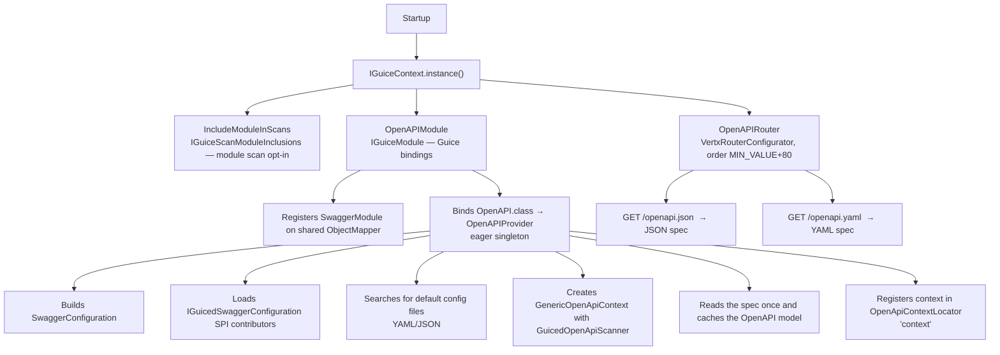
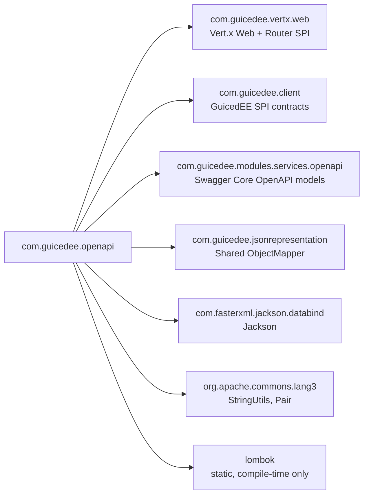

# GuicedEE OpenAPI

[](https://github.com/GuicedEE/OpenAPI/actions/workflows/build.yml)
[](https://central.sonatype.com/artifact/com.guicedee/openapi)
[](https://www.apache.org/licenses/LICENSE-2.0)


Automatic **OpenAPI 3.1 spec generation and serving** for the [GuicedEE](https://github.com/GuicedEE) / Vert.x stack.
Add the dependency, annotate your Jakarta REST resources, and the module scans them at startup — `/openapi.json` and `/openapi.yaml` are live with zero configuration.

Built on [Swagger Core 2 (OpenAPI 3.1)](https://github.com/swagger-api/swagger-core) · [Vert.x 5](https://vertx.io/) · [Google Guice](https://github.com/google/guice) · JPMS module `com.guicedee.openapi` · Java 25+

## 📦 Installation

```xml
<dependency>
  <groupId>com.guicedee</groupId>
  <artifactId>openapi</artifactId>
</dependency>
```

<details>
<summary>Gradle (Kotlin DSL)</summary>

```kotlin
implementation("com.guicedee:openapi:2.0.2-SNAPSHOT")
```
</details>

> **Swagger UI** — for a browsable UI add the companion module `guiced-swagger-ui`:
>
> ```xml
> <dependency>
>   <groupId>com.guicedee</groupId>
>   <artifactId>swagger-ui</artifactId>
> </dependency>
> ```

## ✨ Features

- **Zero-config spec generation** — `GuicedOpenApiScanner` uses the ClassGraph scan result to discover `@Path`, `@ApplicationPath`, `@OpenAPIDefinition`, and `@Webhooks` annotated classes automatically
- **JSON + YAML endpoints** — `OpenAPIRouter` registers `/openapi.json` and `/openapi.yaml` on the Vert.x `Router` at startup
- **OpenAPI 3.1** — spec is generated with `convertToOpenAPI31(true)` by default
- **SPI customization** — implement `IGuicedSwaggerConfiguration` to modify the `OpenAPIConfiguration` (title, version, servers, resource packages, etc.) before the context initializes
- **Auto-discovery of config files** — searches classpath and filesystem for `openapi-configuration.yaml`, `openapi-configuration.json`, `openapi.yaml`, `openapi.json`
- **Guice-managed singleton** — the `OpenAPI` model is bound as an eager singleton via `OpenAPIProvider`; inject it anywhere with `@Inject OpenAPI openAPI`
- **Jackson integration** — the Swagger Jackson module is registered on the shared `ObjectMapper` automatically
- **JPMS + ServiceLoader friendly** — fully modular with `module-info.java` and `META-INF/services` descriptors

## 🚀 Quick Start

**Step 1** — Add the dependency (see [Installation](#-installation)).

**Step 2** — Annotate a GuicedEE REST resource:

```java
@Path("/hello")
@Produces(MediaType.APPLICATION_JSON)
public class HelloResource {

    @GET
    @Path("/{name}")
    public String hello(@PathParam("name") String name) {
        return "Hello " + name;
    }
}
```

**Step 3** — Bootstrap GuicedEE:

```java
IGuiceContext.instance().inject();
```

That's it. `GuicedOpenApiScanner` discovers `HelloResource`, the `OpenAPIProvider` builds the spec, and `OpenAPIRouter` serves it:

```
GET http://localhost:8080/openapi.json   → OpenAPI 3.1 JSON
GET http://localhost:8080/openapi.yaml   → OpenAPI 3.1 YAML
```

## 📐 Architecture



### Request lifecycle (spec endpoints)

```
HTTP GET /openapi.json
 → Vert.x Router
   → OpenAPIRouter handler
     → IGuiceContext.get(OpenAPI.class)       ← cached singleton
     → OpenApiContext.getOutputJsonMapper()   ← Swagger Jackson mapper
     → Pretty-print JSON → 200 response

HTTP GET /openapi.yaml
 → Same flow with getOutputYamlMapper()
```

## ⚙️ Configuration

### Default configuration file discovery

`OpenAPIProvider` searches the following locations (first match wins):

| Scheme | File |
|---|---|
| `classpath` | `openapi-configuration.yaml` |
| `classpath` | `openapi-configuration.json` |
| `classpath` | `openapi.yaml` |
| `classpath` | `openapi.json` |
| `file` | `openapi-configuration.yaml` |
| `file` | `openapi-configuration.json` |
| `file` | `openapi.yaml` |
| `file` | `openapi.json` |

Place one of these files on the classpath (e.g. `src/main/resources/openapi-configuration.yaml`) to supply default metadata:

```yaml
openAPI: "3.1.0"
info:
  title: "My Service"
  version: "1.0.0"
  description: "My awesome microservice"
servers:
  - url: "http://localhost:8080"
    description: "Local dev"
```

### SPI configuration (`IGuicedSwaggerConfiguration`)

Implement the `IGuicedSwaggerConfiguration` interface and register it via ServiceLoader to programmatically modify the configuration before the OpenAPI context initializes:

```java
public class MySwaggerConfig implements IGuicedSwaggerConfiguration {
    @Override
    public OpenAPIConfiguration config(OpenAPIConfiguration config) {
        ((SwaggerConfiguration) config)
            .resourcePackages(Set.of("com.example.api"))
            .prettyPrint(true);
        return config;
    }
}
```

Register in `module-info.java`:

```java
module my.app {
    provides com.guicedee.guicedservlets.openapi.services.IGuicedSwaggerConfiguration
        with com.example.MySwaggerConfig;
}
```

Or in `META-INF/services/com.guicedee.guicedservlets.openapi.services.IGuicedSwaggerConfiguration`:

```
com.example.MySwaggerConfig
```

### SwaggerConfiguration defaults

The following defaults are set by `OpenAPIProvider`:

| Property | Default |
|---|---|
| `readAllResources` | `true` |
| `convertToOpenAPI31` | `true` |
| `alwaysResolveAppPath` | `true` |
| `prettyPrint` | `true` |

## 🔍 Resource Scanning

`GuicedOpenApiScanner` uses the ClassGraph `ScanResult` already produced by `IGuiceContext` — no additional scanning pass is needed.

### Discovery strategy

1. **Explicit classes** — if `resourceClasses` is set in configuration, those are loaded directly
2. **Explicit packages** — if `resourcePackages` is set, only classes from those packages are included
3. **Full scan** — otherwise all classes annotated with `@Path`, `@ApplicationPath`, `@OpenAPIDefinition`, or `@Webhooks` are included, minus ignored packages

### Ignored packages

The scanner excludes:

- All packages from Swagger Core's `IgnoredPackages.ignored` set
- `io.swagger.v3.jaxrs2`
- `com.guicedee.guicedservlets.openapi.implementations`

### OpenAPI annotations

Use standard Swagger/OpenAPI annotations to enrich the generated spec:

```java
@Path("/users")
@Produces(MediaType.APPLICATION_JSON)
@Tag(name = "Users", description = "User management")
public class UserResource {

    @GET
    @Path("/{id}")
    @Operation(
        summary = "Get user by ID",
        description = "Returns a single user",
        responses = {
            @ApiResponse(responseCode = "200", description = "User found"),
            @ApiResponse(responseCode = "404", description = "User not found")
        }
    )
    public User getUser(@PathParam("id") @Parameter(description = "User ID") Long id) {
        return userService.find(id);
    }
}
```

## 💉 Injecting the OpenAPI Model

The `OpenAPI` model is bound as an eager singleton. Inject it anywhere:

```java
@Inject
private OpenAPI openAPI;
```

Or retrieve it programmatically:

```java
OpenAPI api = IGuiceContext.get(OpenAPI.class);
```

This is the same cached instance used by the `/openapi.json` and `/openapi.yaml` endpoints.

## 🔌 SPI & Extension Points

| SPI | Purpose |
|---|---|
| `IGuicedSwaggerConfiguration` | Modify `OpenAPIConfiguration` before the context initializes |
| `VertxRouterConfigurator` | Customize the Vert.x `Router` (provided by `OpenAPIRouter`) |
| `IGuiceModule` | Contribute Guice bindings (provided by `OpenAPIModule`) |
| `IGuiceScanModuleInclusions` | Opt modules into ClassGraph scanning (provided by `IncludeModuleInScans`) |

## 🗺️ Module Graph



## 🧩 JPMS

Module name: **`com.guicedee.openapi`**

The module:
- **exports** `com.guicedee.guicedservlets.openapi.services`
- **uses** `IGuicedSwaggerConfiguration`
- **provides** `IGuiceScanModuleInclusions` with `IncludeModuleInScans`
- **provides** `IGuiceModule` with `OpenAPIModule`
- **provides** `VertxRouterConfigurator` with `OpenAPIRouter`
- **opens** `services` and `implementations` packages to `com.google.guice`

## 🏗️ Key Classes

| Class | Package | Role |
|---|---|---|
| `OpenAPIRouter` | `implementations` | `VertxRouterConfigurator` that registers `/openapi.json` and `/openapi.yaml` routes (sort order `MIN_VALUE + 80`) |
| `OpenAPIProvider` | `implementations` | Guice `Provider<OpenAPI>` — builds the `SwaggerConfiguration`, applies SPI customizers, initializes the OpenAPI context, and caches the model |
| `GuicedOpenApiScanner` | `implementations` | `OpenApiScanner` that uses the ClassGraph `ScanResult` to discover resource classes |
| `OpenAPIModule` | `implementations` | `IGuiceModule` — registers the Swagger Jackson module and binds `OpenAPI` as an eager singleton |
| `IncludeModuleInScans` | `implementations` | `IGuiceScanModuleInclusions` — opts the module into scan-based discovery |
| `IGuicedSwaggerConfiguration` | `services` | SPI interface for programmatic `OpenAPIConfiguration` customization |

## 🧪 Testing

The test suite bootstraps GuicedEE, starts the Vert.x HTTP server, and verifies the spec endpoints:

```java
IGuiceContext.instance().inject();

HttpClient client = HttpClient.newBuilder()
    .connectTimeout(Duration.of(5, ChronoUnit.SECONDS))
    .build();

// Verify JSON endpoint
HttpResponse<String> response = client.send(
    HttpRequest.newBuilder()
        .GET()
        .uri(new URI("http://localhost:8080/openapi.json"))
        .build(),
    HttpResponse.BodyHandlers.ofString());

assertEquals(200, response.statusCode());
assertTrue(response.body().contains("\"openapi\" :"));

// Verify YAML endpoint
response = client.send(
    HttpRequest.newBuilder()
        .GET()
        .uri(new URI("http://localhost:8080/openapi.yaml"))
        .build(),
    HttpResponse.BodyHandlers.ofString());

assertEquals(200, response.statusCode());
```

Run tests:

```bash
mvn test
```

## 🤝 Contributing

Issues and pull requests are welcome — please add tests for new configuration options or scanner enhancements.

## 📄 License

[Apache 2.0](https://www.apache.org/licenses/LICENSE-2.0)
